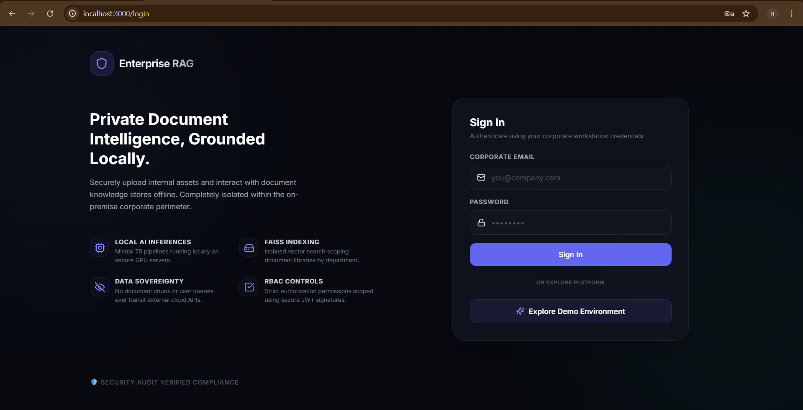
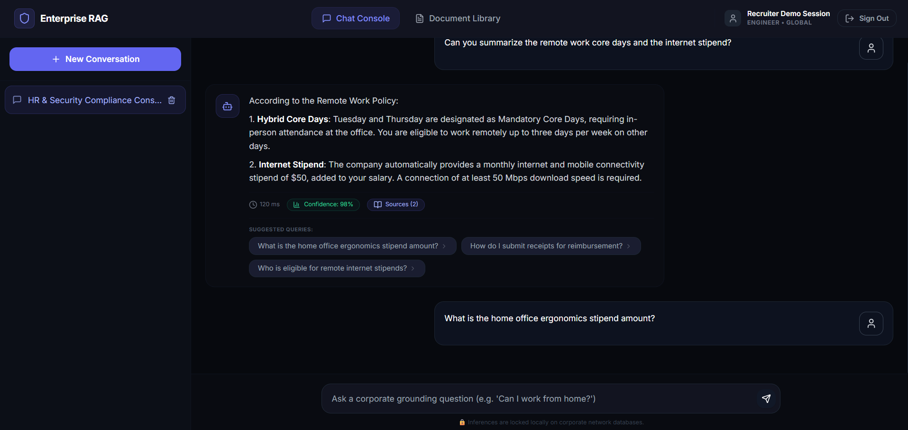
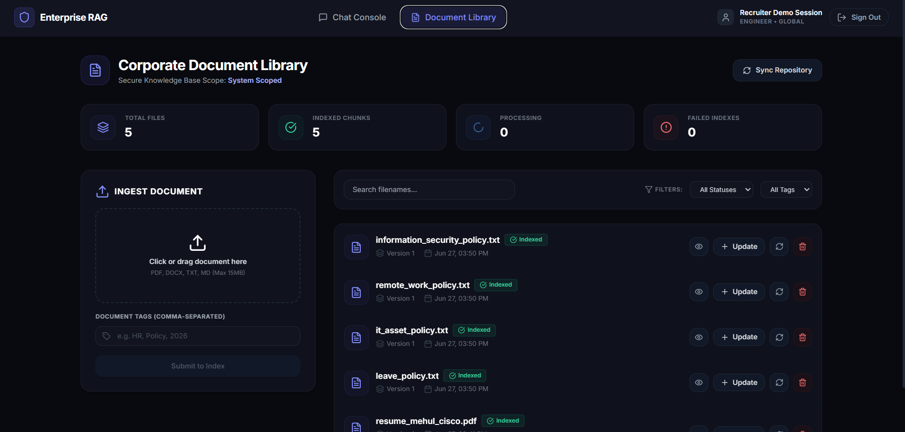
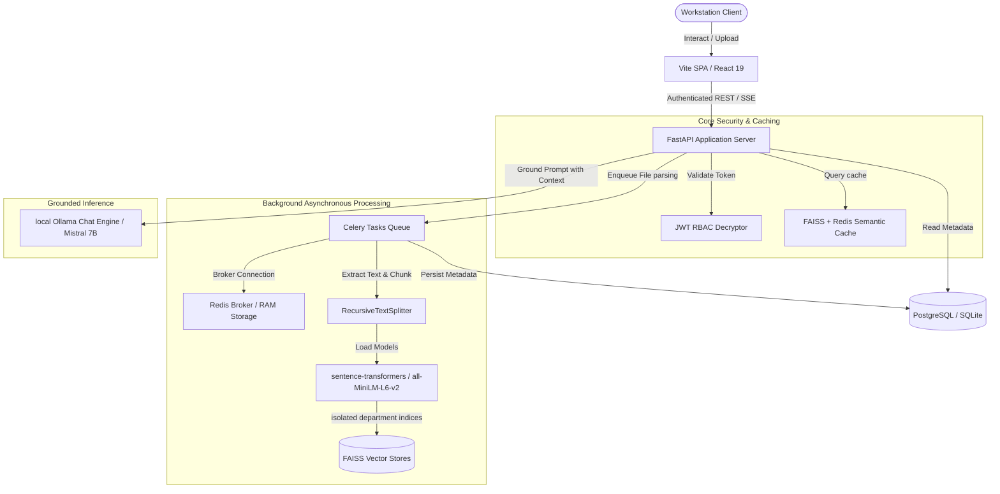

# Enterprise Grounded RAG Chatbot 🛡️

[](LICENSE)
[](https://www.python.org/)
[](https://react.dev/)
[](https://www.docker.com/)

A secure, production-grade, on-premise Retrieval-Augmented Generation (RAG) platform. Securely ingest corporate documents, index text fragments into isolated departmental boundaries, and query local LLMs offline. Built for absolute data sovereignty, speed, and enterprise reliability.

---

##  Platform Interface Screenshots

### Redesigned Login Dashboard


### Conversational Grounded Chat Console


### Document Management & Statistics Directory



## 🏛️ System Architecture Workflow



---

##  Core Enterprise Features

*   ** Absolute Data Sovereignty:** Run parsing, embeddings generation (`sentence-transformers/all-MiniLM-L6-v2`), and LLM inference (`Mistral-7B` via Ollama) 100% locally. Zero text, vectors, or chat transcripts transit external networks or APIs.
*   ** Sub-10ms Semantic Prompt Caching:** Integrated FAISS-based semantic query cache coupled with Redis key-value stores. duplicate or highly similar queries bypass LLM inferences entirely to yield sub-10ms response times.
*   ** Asynchronous Worker Pipelines:** Celery tasks and Redis background brokers managing document parsing, text chunking, and index insertions.
*   ** Scoped Department Isolation:** Multi-tenant document mapping. Chunks and indexes are isolated dynamically, ensuring employees can only query resources scoped to their security permission boundaries.
*   ** Workstation Demo Mode:** Instant recruiter login sandbox (`demo@enterprise-rag.ai` / `Demo@123`) loaded with sample HR documents (leave policies, remote working, asset management) and full chat history.

---

##  Repository Organization

```
enterprise-rag-chatbot/
├── backend/
│   ├── app/
│   │   ├── api/          # FastAPI routes (Auth, Documents, Chats, Admin)
│   │   ├── core/         # Settings, Database configuration, Security engines
│   │   ├── models/       # SQLAlchemy tables definitions
│   │   ├── rag/          # Embeddings singelton, FAISS vector stores, LLM streams
│   │   └── workers/      # Celery task execution nodes
│   └── tests/            # Pytest testing suite
├── frontend/
│   ├── src/
│   │   ├── components/   # Route guards and UI containers
│   │   ├── context/      # JWT state context
│   │   ├── pages/        # Login, ChatConsole, DocumentLibrary, AdminConsole
│   │   └── services/     # Axios client API configurations
│   └── package.json
├── docs/
│   ├── architecture/     # Diagrams mapping system flows
│   ├── screenshots/      # Platform interface screenshots
│   ├── api/              # Swagger API details
│   └── deployment/       # Render, Vercel, Neon, and Upstash instructions
├── docker-compose.yml    # Complete stack orchestrator
├── README.md             # Recruiter developer presentation guide
├── LICENSE               # Open-source licensing
└── CONTRIBUTING.md       # Collaboration guidelines
```

---

##  Quickstart Local Setup

### System Prerequisites
*   [Docker & Docker Compose](https://www.docker.com/products/docker-desktop/) (Docker Desktop recommended)
*   [Ollama](https://ollama.com/) running locally with the **Mistral** model loaded:
    ```bash
    ollama run mistral
    ```

### Docker Compose Orchestration (Recommended)
You can launch the entire stack (PostgreSQL, Redis, Backend API, Frontend SPA) with a single command:
1.  Initialize local settings files:
    ```bash
    cp .env.example .env
    ```
2.  Start the containers:
    ```bash
    docker-compose up --build
    ```
3.  Access the applications:
    *   **Frontend SPA:** `http://localhost:5173`
    *   **Backend Server:** `http://localhost:8000`
    *   **Swagger API Docs:** `http://localhost:8000/docs`

---

##  Developer Manual Local Installation

### Backend Setup (FastAPI)
1.  Navigate into backend folder and create virtual environment:
    ```bash
    cd backend
    python -m venv venv
    .\venv\Scripts\activate
    ```
2.  Install dependencies:
    ```bash
    pip install -r requirements.txt
    ```
3.  Apply Alembic database migrations:
    ```bash
    alembic upgrade head
    ```
4.  Run database seeder (initializes roles, demo user, and chunks policy files):
    ```bash
    $env:PYTHONPATH='.'
    python app/utils/seeder.py
    ```
5.  Launch API server:
    ```bash
    python -m uvicorn app.main:app --host 127.0.0.1 --port 8000
    ```

### Frontend Setup (Vite / React)
1.  Navigate into frontend folder and install dependencies:
    ```bash
    cd frontend
    npm install
    ```
2.  Start Vite dev server:
    ```bash
    npm run dev
    ```

---

## 🛡️ Recruiter Demo Sandbox Login
Recruiters can immediately explore the platform without creating accounts or indexing documents:
*   **Email Address:** `demo@enterprise-rag.ai`
*   **Session Password:** `Demo@123`
*   **Quick Entry:** Simply click the **"Explore Demo Environment"** button on the sign-in page to trigger the typing simulation and log in instantly.
