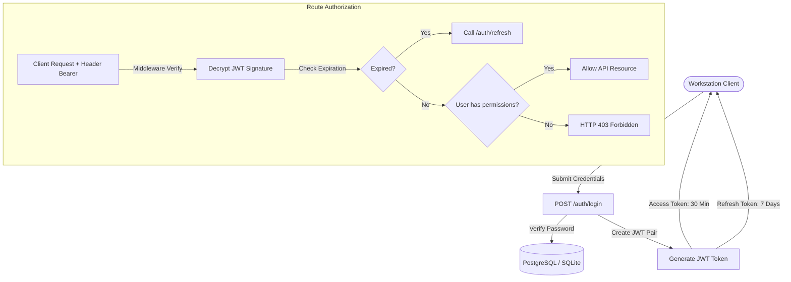

# Security & Authentication Architecture

This document details the authentication and Role-Based Access Control (RBAC) layers securing the system.

---

## Technical Details

### 1. Token Specification
*   **Access Token:** Short-lived JWT containing user metadata (email, role ID, department ID, permissions) signed with `HS256`. Expiry: 30 minutes.
*   **Refresh Token:** Long-lived JWT stored in local state, sent to `/auth/refresh` to fetch a new access token without requiring re-entry of password credentials. Expiry: 7 days.

### 2. Permissions Matrix

| Role | Permissions | Target Operations |
| ---- | ----------- | ----------------- |
| **ADMIN** | `users:read`, `users:write`, `doc:upload`, `doc:read`, `doc:write`, `chat:read`, `chat:write` | Full control of directories, uploads, chats, configurations. |
| **MANAGER** | `doc:upload`, `doc:read`, `doc:write`, `chat:read`, `chat:write` | Ingest and delete departmental files, start grounded conversations. |
| **ENGINEER** | `doc:upload`, `doc:read`, `chat:read`, `chat:write` | Ingest new files, start conversations. Cannot delete files or users. |
| **VIEWER** | `doc:read`, `chat:read` | Read-only access to files and public chat logs. |
