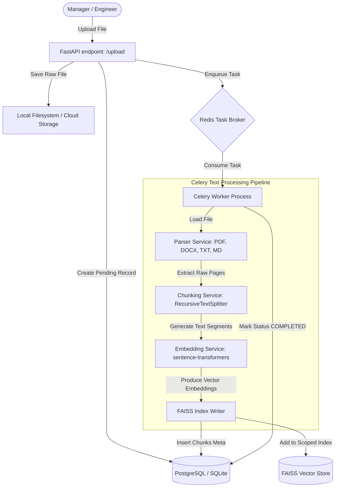

# Document Ingestion and Vectorization Pipeline

This document details the step-by-step architecture of the asynchronous document ingestion and vectorization pipeline.

---

## Technical Details

### 1. Ingestion Endpoint
*   **FastAPI route:** `POST /api/v1/documents/upload`
*   **Access Scope:** Protected by JWT Authentication and requires `doc:upload` scope (default roles: `ADMIN`, `MANAGER`, `ENGINEER`).

### 2. Task Asynchrony
*   File data ingestion can take significant time for large manuals. The system delegates vector computations to background Celery workers.
*   While active processing takes place, the status in the database remains `PENDING` or `PROCESSING`.

### 3. Chunking Configuration
*   **Chunk size:** 1000 characters.
*   **Overlap size:** 200 characters (to maintain context across split points).
*   **Algorithm:** Recursive Character Text Splitter (splits on paragraph, sentence, and word boundaries).

### 4. Embedding Generation
*   **Embedding Model:** `sentence-transformers/all-MiniLM-L6-v2` (384-dimensional dense vectors).
*   **Execution:** Runs locally via HuggingFace `sentence-transformers` library, requiring no third-party API keys or external network transit.
