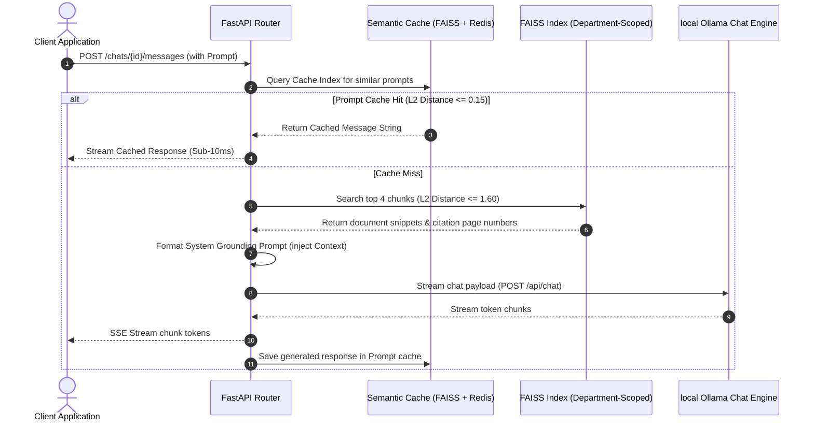

# RAG Retrieval & Similarity Inference Pipeline

This document details how the Retrieval-Augmented Generation (RAG) loop queries vector stores and grounds model responses.

---

## Technical Details

### 1. Department Isolation
*   FAISS indices are stored in isolated sub-directories based on the department UUID: `./data/vector_store/dept_<uuid>/`.
*   Users can **only** search within the department they are assigned to, guaranteeing data boundary isolation.

### 2. Matching Threshold
*   **Distance metric:** Euclidean L2 distance squared ($L_2^2$).
*   **Threshold:** `score <= 1.60` (ensures matching snippets have a cosine similarity of at least `0.20`, filtering out unrelated text while preserving weak matches).

### 3. LLM Grounding
*   The system uses the central `SYSTEM_RAG_PROMPT` configuring the LLM as a secure assistant.
*   **Grounding Rule:** If the snippets do not contain enough facts to resolve the query, the model is strictly bound to output a default "Information not found" sentence, preventing hallucination.
